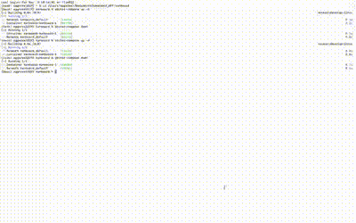
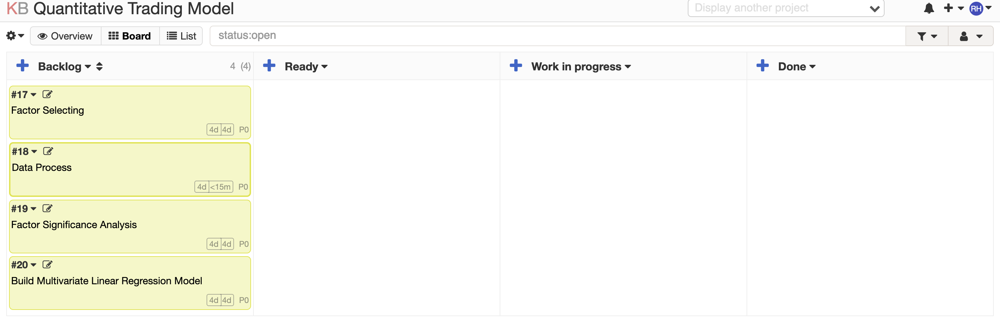

<h1 align="center">Generative LLM-agents for Application Development (GLAD)</h1>


## Project Overview

GLAD is a generative LLM-agent system designed to streamline task management and automate the workflow for Kanboard API-based applications. Built with LangChain and integrated with OpenAI’s models, GLAD uses structured prompts and API methods to manage complex, multi-step processes within Kanboard.



### Version 1 Features (iKb 1.0)
- **One-Click KB Code Generation:** Instantly generates KB code based on minimal input.
- **NL2Workflow:** Converts natural language commands into structured workflows.
- **Scalability:** Designed to handle complex tasks and scale with ease.
- **Automated Task Splitting:** Dynamically splits complex tasks into actionable subtasks.
- **API Parameter Identification:** Extracts parameters required for executing subtasks via the Kanboard API.
- **Method Selection for Execution:** Matches subtasks with the most suitable API methods based on their parameters.
- **Streamlined Execution with Interactive UI:** A user-friendly Streamlit interface enables task submission, subtask visualization, and result checking.

## Project Details

### Task Splitting and API Interaction
- **TaskSplitter:** A custom LangChain tool that decomposes complex tasks into logical, ordered subtasks, assessing each step for API compatibility.
- **Parameter Identification:** Identifies parameters for executable subtasks, structured by task type (project, column, or task).
- **Method Selector:** Automatically selects the best-suited Kanboard API method for each identified task type and parameter set.

### Drag-and-Drop Interface
Implemented with Streamlit, the interface supports the following:
- **Task Submission**: Users input task descriptions to generate Kanboard-compatible workflows.
- **Interactive Debugging**: Real-time view and validation of task decomposition, parameter extraction, and method selection.

### CSS Styling and UI
- Custom CSS styling for an intuitive, card-like display of tasks and results, enhancing user experience.

## Getting Started

### Installation
Kanboard Docker Deployment Guide

To deploy Kanboard on Docker, you can follow this detailed guide: [How to Deploy Kanboard to Docker](https://blog.csdn.net/weixin_33961829/article/details/85959383?utm_medium=distribute.pc_relevant.none-task-blog-2~default~baidujs_baidulandingword~default-0-85959383-blog-85775050.235^v43^pc_blog_bottom_relevance_base7&spm=1001.2101.3001.4242.1&utm_relevant_index=1)


To set up the project locally:
```bash
# Install dependencies
pip install -r requirements.txt

# Run the Streamlit app
streamlit run app.py
```

### Environment Variables
Add your OpenAI and Kanboard API credentials to an `.env` file:

```plaintext
KANBOARD_API_URL="http://localhost:8081/jsonrpc.php"
API_TOKEN="YOUR_API_TOKEN_HERE"
OPENAI_API_KEY="YOUR_OPENAI_API_KEY_HERE"
```

## Case Study

### Goal
To use a multi-factor model to guide a $1 million investment, aiming for returns exceeding the benchmark index by at least 3%.

### Scenario
The project team is developing a Stock Quantitative Trading Strategy based on a traditional multi-factor model. The mission is to analyze and optimize factors to create an efficient investment decision-making model for a $1 million investment.

**With iKB**: Utilizing iKBColumns, Task Cards, and Calendars to automate task structuring and assignment, enhancing project management and efficiency.



### Supported API Methods
GLAD currently supports the following Kanboard API methods:

- `createProject`
- `getProjectByName`
- `getBoard`
- `createTask`
- `closeTask`
- `moveTaskPosition`

## Future Improvements


To enhance functionality and provide comprehensive investment guidance, the following improvements are planned:

- **Integration with Company News and Insights**: Incorporate real-time company news and market insights to improve decision-making and strategy adjustments.
- **Multi-Agent Collaboration**: Implement multiple agents that collaborate to analyze different aspects of the market, delivering more accurate and informed recommendations.
- **Enhanced Professional Responses**: Upgrade response mechanisms to provide more expert-level analysis and guidance for investment strategies.
- **Improved UI and HCI**: Develop a more polished user interface with enhanced human-computer interaction, offering a seamless and intuitive user experience.

These improvements aim to create a robust, interactive platform for investors seeking data-driven guidance and insights.
